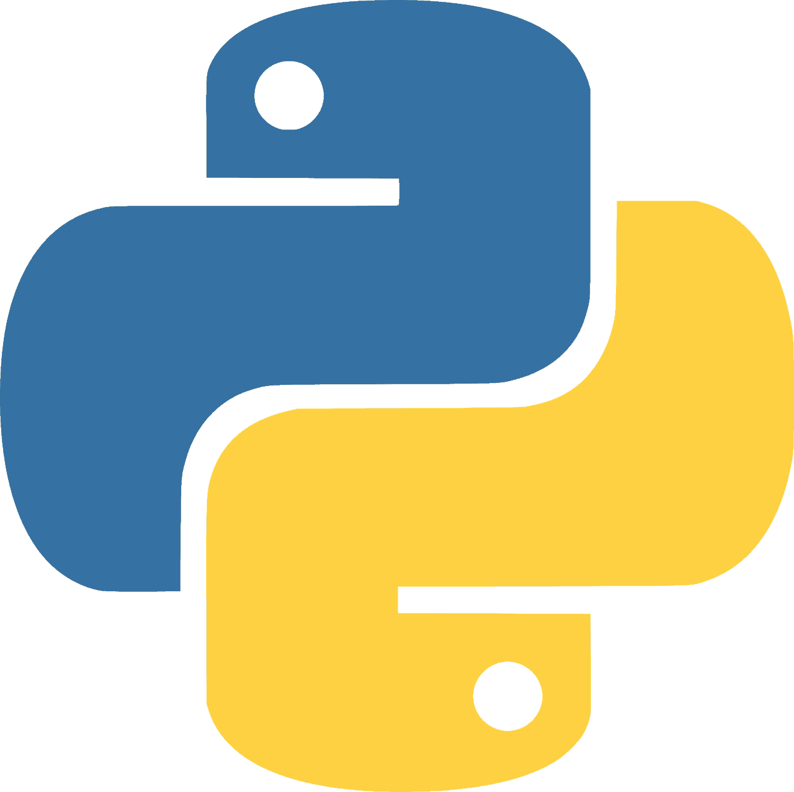

<h1>
    
</h1>

## Informations

🡠- I'm a house person 
📖 - I'm a high school student 
🔒 - I'm actually private person 
💻 - I actually spend all my time with gadgets 

## What languages do I know?

 - Python (__All versions__) 
 - C/C++ (__I know few syntax__) 
 - Javascript (__I'm still learning it__)

## What topics I love?

💻 - Programming 
🮠- Gaming 
🧠 - Machine Learning 
🕵️‍ - Hacking 
🔌 - Networking 

## Projects
> I deleted some of my repos. I don't know why lol.

[Flatipie](https://github.com/flatipie/flatipie) - An open source framework for building qt modern applications. I made this actually to deploy apps easily with python.

#### Upcoming projects

[Pie IDE](https://github.com/zenqii/pie) - A simple yet powerful, friendly-user **Python IDE** for beginners. 
[Pixel Worlds API](https://github.com/zenqii/pixelworldsapi) - A python wrapper for [**Pixel Worlds**](https://store.steampowered.com/app/636040/Pixel_Worlds_MMO_Sandbox/)' data. 
[Membrane](https://github.com/zenqii/membrane) - All in one tool for security researchers, penetration tester and hackers. 
hscript - A powerfull programming language that aims to build and code easily without any struggle. **(i'm planning it)**

